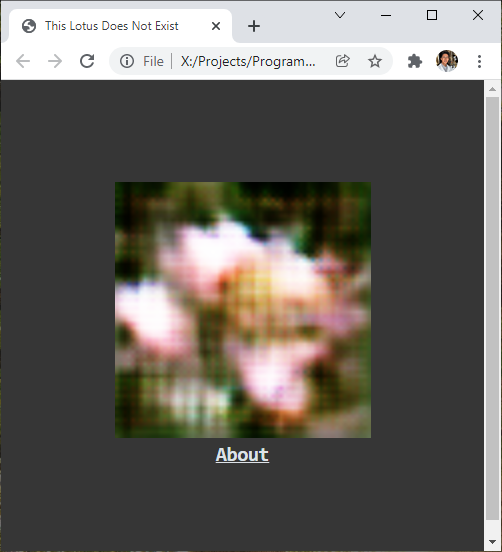

# Lotus GAN

This project used a TensorFlow Deep Convolutional Generative Adversarial Network (GAN) to generate 64x64 lotus images and then displayed them on a simple website.

I found my training images from Oxford 102, a 102 Category Flower Dataset. I preprocessed my data until I had 134 64x64 input lotus images. I then used a Google Colab GPUs to run 3000 epochs with my GAN implementation.

I then built a simple HTML, CSS, and JavaScript website to display my result images.

